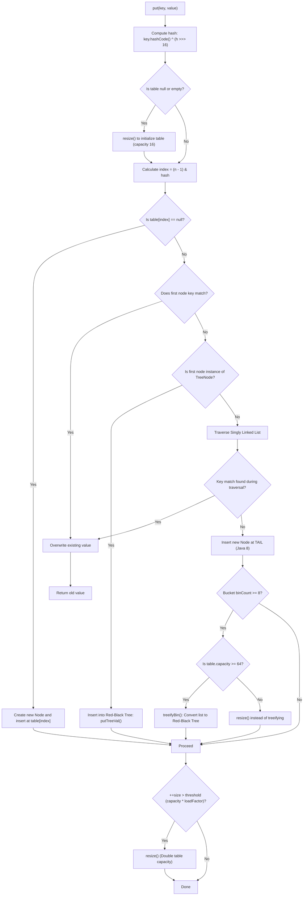

# Deep Dive 01: Java HashMap Internals (Java 8+)

## 1. High-Level Architecture

`java.util.HashMap` in Java 8+ is implemented as an **Array of Buckets (Nodes)**, where each bucket can be either:
1. **Empty** (`null`)
2. A **Singly Linked List** of `Node<K, V>`
3. A **Red-Black Tree** of `TreeNode<K, V>` (balanced binary search tree)

```
Index:    0      1               2               3
Table: [null] [Node] ------> [Node] ---------> [null]
                │
              [Node]  (Linked List when entries < 8)
                │
              [Node]
                
Index:    4
Table: [TreeNode] (Red-Black Tree when entries >= 8 && table.capacity >= 64)
          /    \
     [TreeNode] [TreeNode]
```

---

## 2. Default Constants & Configurations

| Parameter | Default Value | Significance |
|---|---|---|
| `DEFAULT_INITIAL_CAPACITY` | `1 << 4` (16) | Must always be a **power of 2**. |
| `MAXIMUM_CAPACITY` | `1 << 30` ($2^{30}$) | Maximum allowable table size. |
| `DEFAULT_LOAD_FACTOR` | `0.75f` | Balance between space complexity and search time. |
| `TREEIFY_THRESHOLD` | `8` | Count of nodes in a bucket before converting list to tree. |
| `UNTREEIFY_THRESHOLD` | `6` | Count of nodes in a bucket during resize to convert tree back to list. |
| `MIN_TREEIFY_CAPACITY` | `64` | Minimum total table capacity before treeification occurs. |

> [!IMPORTANT]
> **Why 8 for treeify and 6 for untreeify?**
> * Under random hash codes following a Poisson distribution, the probability of 8 collisions in one bucket is less than $1 \text{ in } 10,000,000$ ($\approx 0.00000006$). Treeification is a safety measure against poor hash codes or malicious DOS attacks.
> * The gap (8 to treeify, 6 to untreeify) prevents **thrashing** (constant conversion back-and-forth if an element is repeatedly added and removed at threshold 8).

---

## 3. The Math: Hash Function & Index Calculation

### Step 1: The Perturbation Function
In `HashMap.java`:
```java
static final int hash(Object key) {
    int h;
    return (key == null) ? 0 : (h = key.hashCode()) ^ (h >>> 16);
}
```

#### Why XOR with unsigned right shift by 16 (`h ^ (h >>> 16)`)?
* In Java, `hashCode()` returns a 32-bit integer.
* For small tables (e.g., initial capacity 16), the index mask `(n - 1) = 15` only checks the **lowest 4 bits**.
* Without perturbation, the top 28 bits would be completely discarded. Any keys sharing the same last 4 bits would collide, regardless of differences in the top 28 bits.
* `>>> 16` slides the top 16 bits down into the bottom 16 positions:

```
Original h:       [   UPPER 16 BITS   ]   [   LOWER 16 BITS   ]
       ^                 XOR                      XOR
h >>> 16:         [ 00000000 00000000 ]   [   UPPER 16 BITS   ]
------------------------------------------------------------------
Final hash:       [   UPPER 16 BITS   ]   [ LOWER ^ UPPER (Mixed!) ]
```
* **Result**: The lower bits now carry information from the upper bits. Collisions drop significantly.

---

### Step 2: Fast Index Calculation (Bitwise AND)
```java
index = (n - 1) & hash;  // where n is table.length (strictly a power of 2)
```

#### Why Bitwise AND (`&`) instead of Modulo (`%`)?
* Modulo (`%`) requires hardware division, taking 20–40 CPU clock cycles.
* Bitwise AND (`&`) is a simple masking operation that executes in **1 CPU clock cycle**.

#### Visual Example:
Let `hash = 77` and table capacity $n = 16$ (so mask $n - 1 = 15$):

```
  hash (77):     0 1 0 0   1 1 0 1   (Binary)
& mask (15):     0 0 0 0   1 1 1 1   (Mask: only last 4 bits pass through)
-----------------------------------
  Result:        0 0 0 0   1 1 0 1   = 13 in decimal! (77 % 16 == 13)
```

#### Why MUST capacity be a power of 2?
When $n = 2^k$, $n - 1$ is always a sequence of binary `1`s (e.g., $16 - 1 = 15 = 00001111_2$).
If $n = 10$ (not a power of 2), $n - 1 = 9 = 00001001_2$. 
Bits 1 and 2 would always evaluate to `0`, making indices 2, 3, 4, 5, 6, 7 impossible to ever reach! Half of the buckets would sit permanently empty.

---

## 4. `put(K key, V value)` Execution Lifecycle



---

## 5. Resize Mechanism (`resize()`) & The Java 8 Optimization

When `size > threshold` (e.g., $16 \times 0.75 = 12$), the table doubles in capacity ($n \to 2n$).

### The Java 7 Problem:
* Java 7 used **Head Insertion** in buckets.
* When two threads resized concurrently, pointer references could be reversed, forming a **circular loop** (`A -> B -> A`).
* Subsequent `get()` operations resulted in an **infinite loop taking 100% CPU**.

### The Java 8 Solution:
1. **Tail Insertion**: Preserves the original order of nodes, eliminating the circular reference bug.
2. **Re-hashing Trick**: Java 8 **does not recalculate** `hash % newCapacity`.
   * Because capacity doubles from $2^k$ to $2^{k+1}$, the bitmask $(n-1)$ extends by exactly **1 bit** to the left.
   * We only inspect that single bit using: `(e.hash & oldCap) == 0`.
   * If bit is `0`: element stays at **`oldIndex`**.
   * If bit is `1`: element moves to **`oldIndex + oldCap`**.

---

## 6. Contract Between `equals()` and `hashCode()`

### The Rule:
1. If `o1.equals(o2)` is `true`, then `o1.hashCode() == o2.hashCode()` **MUST** be `true`.
2. If `o1.hashCode() == o2.hashCode()`, `o1.equals(o2)` can be `true` or `false` (collision).

### What happens if you override `equals()` but NOT `hashCode()`?
* Two logically equal objects will produce **different hash codes**.
* They will land in **different buckets**.
* `map.get(new Person("Alice"))` will return `null` even if you just inserted `map.put(new Person("Alice"), value)`.

### Memory Leak with Mutable Keys:
If a key object is mutated after insertion:
* Its `hashCode()` changes.
* Calling `map.get(key)` calculates a **new bucket index** where the key is absent.
* The original entry is stranded inside the old bucket, unreachable yet retaining memory.
* **Best practice**: Always make Map keys **immutable** (e.g., `String`, `Integer`, or Java 16+ `record`).

---

## 7. Complexity Summary

| Scenario | Average Case | Worst Case (All Collide, Java 7) | Worst Case (All Collide, Java 8+) |
|---|:---:|:---:|:---:|
| `get(key)` | $O(1)$ | $O(N)$ (Linked List) | $O(\log N)$ (Red-Black Tree) |
| `put(key, val)` | $O(1)$ | $O(N)$ | $O(\log N)$ |
| `remove(key)` | $O(1)$ | $O(N)$ | $O(\log N)$ |
